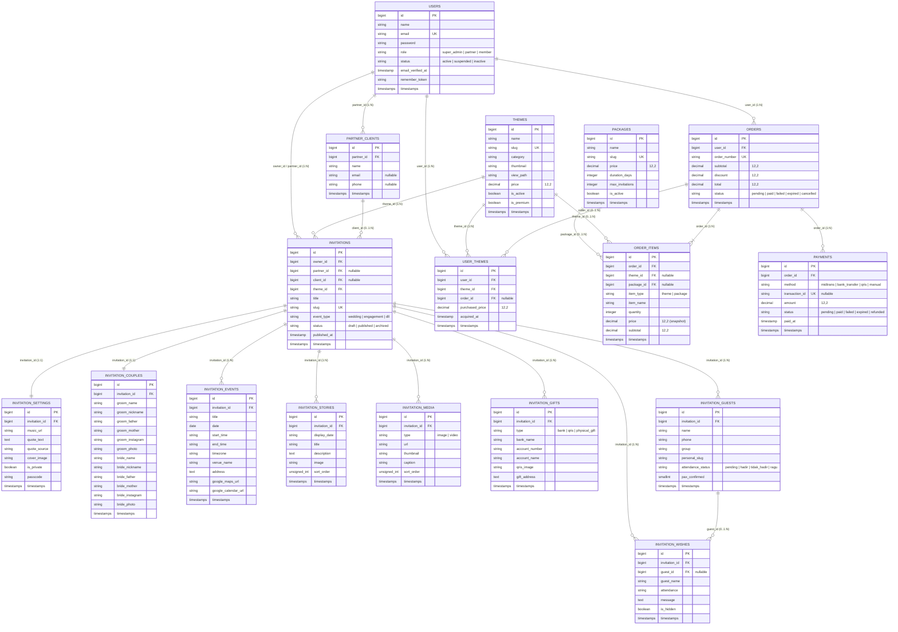

# 02. Spesifikasi Skema Database & ERD (Entity Relationship Diagram)

Dokumen ini mendefinisikan skema basis data baru hasil restrukturisasi secara terperinci, mencakup relasi antarentitas, tipe data, indeks, konvensi penamaan seragam dengan prefix `invitation_*`, serta integritas referensial.

---

## 1. Diagram Relasi Entitas (Mermaid ERD)

---

## 2. Definisi Detail Tabel & Kolom

### 2.1. Tabel `users`
Menyimpan akun pengguna platform.
| Kolom | Tipe Data | Nullable | Default | Indeks / Keterangan |
|---|---|:---:|:---:|---|
| `id` | BIGINT UNSIGNED | Tidak | Auto | Primary Key |
| `name` | VARCHAR(255) | Tidak | - | Nama lengkap |
| `email` | VARCHAR(255) | Tidak | - | UNIQUE |
| `password` | VARCHAR(255) | Tidak | - | Hashed password |
| `role` | VARCHAR(50) | Tidak | `'member'` | Enum string: `super_admin`, `partner`, `member` |
| `status` | VARCHAR(50) | Tidak | `'active'` | Enum string: `active`, `suspended`, `inactive` |
| `email_verified_at` | TIMESTAMP | Ya | NULL | Waktu verifikasi email |
| `remember_token` | VARCHAR(100) | Ya | NULL | Token sesi |
| `created_at` / `updated_at` | TIMESTAMP | Ya | NULL | Standar Laravel timestamps |

---

### 2.2. Tabel `packages`
Menyediakan opsi paket langganan / bundel (Free, Premium, Partner Starter, Partner Pro).
| Kolom | Tipe Data | Nullable | Default | Indeks / Keterangan |
|---|---|:---:|:---:|---|
| `id` | BIGINT UNSIGNED | Tidak | Auto | Primary Key |
| `name` | VARCHAR(255) | Tidak | - | Nama paket |
| `slug` | VARCHAR(255) | Tidak | - | UNIQUE |
| `price` | DECIMAL(12,2) | Tidak | `0.00` | Harga dasar paket |
| `duration_days` | INT UNSIGNED | Tidak | `30` | Durasi aktif paket (hari) |
| `max_invitations` | INT UNSIGNED | Tidak | `1` | Kuota maksimal undangan |
| `is_active` | BOOLEAN | Tidak | `true` | Status aktif paket |
| `created_at` / `updated_at` | TIMESTAMP | Ya | NULL | Timestamps |

---

### 2.3. Tabel `themes`
Katalog desain template undangan.
| Kolom | Tipe Data | Nullable | Default | Indeks / Keterangan |
|---|---|:---:|:---:|---|
| `id` | BIGINT UNSIGNED | Tidak | Auto | Primary Key |
| `name` | VARCHAR(255) | Tidak | - | Nama tema desain |
| `slug` | VARCHAR(255) | Tidak | - | UNIQUE |
| `category` | VARCHAR(100) | Tidak | `'minimalist'` | Kategori: `minimalist`, `jawa`, `sunda`, dll. |
| `thumbnail` | VARCHAR(500) | Ya | NULL | Path/URL thumbnail cover tema |
| `view_path` | VARCHAR(255) | Tidak | - | Path render blade view |
| `price` | DECIMAL(12,2) | Tidak | `0.00` | Harga lisensi tema saat ini |
| `is_active` | BOOLEAN | Tidak | `true` | Apakah tema dapat dipilih/dibeli |
| `is_premium` | BOOLEAN | Tidak | `false` | `false` = gratis langsung didapat, `true` = berbayar |
| `created_at` / `updated_at` | TIMESTAMP | Ya | NULL | Timestamps |

---

### 2.4. Tabel `orders`
Header transaksi bisnis pembelian tema atau paket layanan.
| Kolom | Tipe Data | Nullable | Default | Indeks / Keterangan |
|---|---|:---:|:---:|---|
| `id` | BIGINT UNSIGNED | Tidak | Auto | Primary Key |
| `user_id` | BIGINT UNSIGNED | Tidak | - | Foreign Key ke `users.id` (RESTRICT) |
| `order_number` | VARCHAR(100) | Tidak | - | UNIQUE (misal: `ORD-20260904-XXXX`) |
| `subtotal` | DECIMAL(12,2) | Tidak | `0.00` | Total sebelum diskon |
| `discount` | DECIMAL(12,2) | Tidak | `0.00` | Potongan diskon/promo |
| `total` | DECIMAL(12,2) | Tidak | `0.00` | Total tagihan akhir |
| `status` | VARCHAR(50) | Tidak | `'pending'` | Enum: `pending`, `paid`, `failed`, `expired`, `cancelled` |
| `created_at` / `updated_at` | TIMESTAMP | Ya | NULL | Timestamps |

---

### 2.5. Tabel `order_items`
Rincian item produk (tema individual atau paket) dalam sebuah order.
| Kolom | Tipe Data | Nullable | Default | Indeks / Keterangan |
|---|---|:---:|:---:|---|
| `id` | BIGINT UNSIGNED | Tidak | Auto | Primary Key |
| `order_id` | BIGINT UNSIGNED | Tidak | - | Foreign Key ke `orders.id` (CASCADE) |
| `theme_id` | BIGINT UNSIGNED | Ya | NULL | Foreign Key ke `themes.id` (SET NULL) |
| `package_id` | BIGINT UNSIGNED | Ya | NULL | Foreign Key ke `packages.id` (SET NULL) |
| `item_type` | VARCHAR(50) | Tidak | `'theme'` | Enum string: `theme`, `package` |
| `item_name` | VARCHAR(255) | Tidak | - | Snapshot nama produk saat dibeli |
| `quantity` | INT UNSIGNED | Tidak | `1` | Jumlah item |
| `price` | DECIMAL(12,2) | Tidak | `0.00` | **Snapshot harga saat transaksi** |
| `subtotal` | DECIMAL(12,2) | Tidak | `0.00` | `quantity * price` |
| `created_at` / `updated_at` | TIMESTAMP | Ya | NULL | Timestamps |

---

### 2.6. Tabel `payments`
Pencatatan mutasi dan riwayat pembayaran melalui payment gateway atau manual.
| Kolom | Tipe Data | Nullable | Default | Indeks / Keterangan |
|---|---|:---:|:---:|---|
| `id` | BIGINT UNSIGNED | Tidak | Auto | Primary Key |
| `order_id` | BIGINT UNSIGNED | Tidak | - | Foreign Key ke `orders.id` (CASCADE) |
| `method` | VARCHAR(100) | Tidak | - | `midtrans`, `bank_transfer`, `qris`, `manual` |
| `transaction_id` | VARCHAR(255) | Ya | NULL | ID unik transaksi dari payment gateway |
| `amount` | DECIMAL(12,2) | Tidak | `0.00` | Jumlah pembayaran |
| `status` | VARCHAR(50) | Tidak | `'pending'` | Enum: `pending`, `paid`, `failed`, `expired`, `refunded` |
| `paid_at` | TIMESTAMP | Ya | NULL | Timestamp ketika dana terverifikasi |
| `created_at` / `updated_at` | TIMESTAMP | Ya | NULL | Timestamps |

---

### 2.7. Tabel `user_themes`
**Pusat Inventori & Hak Kepemilikan Tema Pengguna**. Sumber kebenaran tunggal (*single source of truth*) apakah user berhak menggunakan tema tertentu.
| Kolom | Tipe Data | Nullable | Default | Indeks / Keterangan |
|---|---|:---:|:---:|---|
| `id` | BIGINT UNSIGNED | Tidak | Auto | Primary Key |
| `user_id` | BIGINT UNSIGNED | Tidak | - | Foreign Key ke `users.id` (CASCADE) |
| `theme_id` | BIGINT UNSIGNED | Tidak | - | Foreign Key ke `themes.id` (CASCADE) |
| `order_id` | BIGINT UNSIGNED | Ya | NULL | Foreign Key ke `orders.id` (SET NULL) |
| `purchased_price` | DECIMAL(12,2) | Tidak | `0.00` | Snapshot harga perolehan |
| `acquired_at` | TIMESTAMP | Tidak | CURRENT | Waktu perolehan lisensi tema |
| `created_at` / `updated_at` | TIMESTAMP | Ya | NULL | Timestamps |

> [!IMPORTANT]
> **Unique Index**: Kombinasi `UNIQUE KEY(user_id, theme_id)` wajib diterapkan untuk mencegah duplikasi hak kepemilikan tema pada pengguna yang sama saat webhook masuk berkali-kali.

---

### 2.8. Tabel `partner_clients`
Klien pengantin yang dikelola oleh Partner Wedding Organizer.
| Kolom | Tipe Data | Nullable | Default | Indeks / Keterangan |
|---|---|:---:|:---:|---|
| `id` | BIGINT UNSIGNED | Tidak | Auto | Primary Key |
| `partner_id` | BIGINT UNSIGNED | Tidak | - | Foreign Key ke `users.id` (CASCADE) |
| `name` | VARCHAR(255) | Tidak | - | Nama klien / nama pasangan |
| `email` | VARCHAR(255) | Ya | NULL | Email klien |
| `phone` | VARCHAR(50) | Ya | NULL | Nomor kontak WhatsApp klien |
| `created_at` / `updated_at` | TIMESTAMP | Ya | NULL | Timestamps |

---

### 2.9. Tabel `invitations`
Entitas inti / *Aggregate Root* website undangan digital.
| Kolom | Tipe Data | Nullable | Default | Indeks / Keterangan |
|---|---|:---:|:---:|---|
| `id` | BIGINT UNSIGNED | Tidak | Auto | Primary Key |
| `owner_id` | BIGINT UNSIGNED | Tidak | - | Foreign Key ke `users.id` (CASCADE) |
| `partner_id` | BIGINT UNSIGNED | Ya | NULL | Foreign Key ke `users.id` (SET NULL) |
| `client_id` | BIGINT UNSIGNED | Ya | NULL | Foreign Key ke `partner_clients.id` (SET NULL) |
| `theme_id` | BIGINT UNSIGNED | Tidak | - | Foreign Key ke `themes.id` (RESTRICT) |
| `title` | VARCHAR(255) | Tidak | - | Judul undangan (misal: "The Wedding of Dimas & Anisa") |
| `slug` | VARCHAR(255) | Tidak | - | **UNIQUE** (akses publik `/u/{slug}`) |
| `event_type` | VARCHAR(50) | Tidak | `'wedding'` | Jenis acara: `wedding`, `engagement`, dll. |
| `status` | VARCHAR(50) | Tidak | `'draft'` | Enum string: `draft`, `published`, `archived` |
| `published_at` | TIMESTAMP | Ya | NULL | Waktu pertama kali dipublikasikan |
| `created_at` / `updated_at` | TIMESTAMP | Ya | NULL | Timestamps |

---

### 2.10. Tabel `invitation_settings`
Pengaturan preferensi tampilan dan keamanan undangan (1:1 dengan `invitations`).
| Kolom | Tipe Data | Nullable | Default | Indeks / Keterangan |
|---|---|:---:|:---:|---|
| `id` | BIGINT UNSIGNED | Tidak | Auto | Primary Key |
| `invitation_id` | BIGINT UNSIGNED | Tidak | - | **UNIQUE**, FK ke `invitations.id` (CASCADE) |
| `music_url` | VARCHAR(500) | Ya | NULL | File lagu latar latar belakang |
| `quote_text` | TEXT | Ya | NULL | Kutipan romantis / doa / firman suci |
| `quote_source` | VARCHAR(255) | Ya | NULL | Sumber kutipan (misal: "Ar-Rum 21") |
| `cover_image` | VARCHAR(500) | Ya | NULL | Gambar cover utama pop-up buka undangan |
| `is_private` | BOOLEAN | Tidak | `false` | Memerlukan passcode untuk dibuka |
| `passcode` | VARCHAR(50) | Ya | NULL | PIN / sandi akses privat |
| `created_at` / `updated_at` | TIMESTAMP | Ya | NULL | Timestamps |

---

### 2.11. Tabel `invitation_couples`
Data detail calon mempelai pria dan wanita (1:1 dengan `invitations`).
| Kolom | Tipe Data | Nullable | Default | Indeks / Keterangan |
|---|---|:---:|:---:|---|
| `id` | BIGINT UNSIGNED | Tidak | Auto | Primary Key |
| `invitation_id` | BIGINT UNSIGNED | Tidak | - | **UNIQUE**, FK ke `invitations.id` (CASCADE) |
| `groom_name` | VARCHAR(255) | Tidak | - | Nama lengkap pria bergelar |
| `groom_nickname` | VARCHAR(100) | Ya | NULL | Nama panggilan mempelai pria |
| `groom_father` | VARCHAR(255) | Ya | NULL | Nama ayah mempelai pria |
| `groom_mother` | VARCHAR(255) | Ya | NULL | Nama ibu mempelai pria |
| `groom_instagram` | VARCHAR(100) | Ya | NULL | Username Instagram pria |
| `groom_photo` | VARCHAR(500) | Ya | NULL | URL/path foto mempelai pria |
| `bride_name` | VARCHAR(255) | Tidak | - | Nama lengkap wanita bergelar |
| `bride_nickname` | VARCHAR(100) | Ya | NULL | Nama panggilan mempelai wanita |
| `bride_father` | VARCHAR(255) | Ya | NULL | Nama ayah mempelai wanita |
| `bride_mother` | VARCHAR(255) | Ya | NULL | Nama ibu mempelai wanita |
| `bride_instagram` | VARCHAR(100) | Ya | NULL | Username Instagram wanita |
| `bride_photo` | VARCHAR(500) | Ya | NULL | URL/path foto mempelai wanita |
| `created_at` / `updated_at` | TIMESTAMP | Ya | NULL | Timestamps |

---

### 2.12. Tabel `invitation_events`
Daftar sesi acara pernikahan (Akad, Pemberkatan, Resepsi, Ngunduh Mantu).
| Kolom | Tipe Data | Nullable | Default | Indeks / Keterangan |
|---|---|:---:|:---:|---|
| `id` | BIGINT UNSIGNED | Tidak | Auto | Primary Key |
| `invitation_id` | BIGINT UNSIGNED | Tidak | - | FK ke `invitations.id` (CASCADE) |
| `title` | VARCHAR(255) | Tidak | - | Judul sesi (Akad Nikah, Resepsi) |
| `date` | DATE | Tidak | - | Tanggal pelaksanaan |
| `start_time` | VARCHAR(50) | Tidak | `'08:00 WIB'` | Jam mulai |
| `end_time` | VARCHAR(50) | Ya | NULL | Jam selesai / "Selesai" |
| `timezone` | VARCHAR(20) | Tidak | `'WIB'` | WIB, WITA, WIT |
| `venue_name` | VARCHAR(255) | Tidak | - | Nama gedung / lokasi / masjid |
| `address` | TEXT | Ya | NULL | Alamat lengkap acara |
| `google_maps_url` | VARCHAR(500) | Ya | NULL | Tautan penunjuk arah Google Maps |
| `google_calendar_url` | VARCHAR(500) | Ya | NULL | Tautan simpan jadwal ke kalender |
| `created_at` / `updated_at` | TIMESTAMP | Ya | NULL | Timestamps |

---

### 2.13. Tabel `invitation_stories`
Linimasa perjalanan cinta (*Love Story*) kedua mempelai.
| Kolom | Tipe Data | Nullable | Default | Indeks / Keterangan |
|---|---|:---:|:---:|---|
| `id` | BIGINT UNSIGNED | Tidak | Auto | Primary Key |
| `invitation_id` | BIGINT UNSIGNED | Tidak | - | FK ke `invitations.id` (CASCADE) |
| `display_date` | VARCHAR(100) | Tidak | - | Teks waktu (misal: "2020", "14 Februari 2024") |
| `title` | VARCHAR(255) | Tidak | - | Judul babak cerita (misal: "Pertama Bertemu") |
| `description` | TEXT | Tidak | - | Narasi cerita |
| `image` | VARCHAR(500) | Ya | NULL | Foto kenangan momen |
| `sort_order` | INT UNSIGNED | Tidak | `0` | Urutan penayangan |
| `created_at` / `updated_at` | TIMESTAMP | Ya | NULL | Timestamps |

---

### 2.14. Tabel `invitation_media`
Koleksi galeri foto prewedding dan video dokumentasi.
| Kolom | Tipe Data | Nullable | Default | Indeks / Keterangan |
|---|---|:---:|:---:|---|
| `id` | BIGINT UNSIGNED | Tidak | Auto | Primary Key |
| `invitation_id` | BIGINT UNSIGNED | Tidak | - | FK ke `invitations.id` (CASCADE) |
| `type` | VARCHAR(50) | Tidak | `'image'` | Enum string: `image`, `video` |
| `url` | VARCHAR(500) | Tidak | - | File URL media |
| `thumbnail` | VARCHAR(500) | Ya | NULL | Thumbnail pratinjau |
| `caption` | VARCHAR(255) | Ya | NULL | Keterangan gambar |
| `sort_order` | INT UNSIGNED | Tidak | `0` | Urutan tampilan |
| `created_at` / `updated_at` | TIMESTAMP | Ya | NULL | Timestamps |

---

### 2.15. Tabel `invitation_gifts`
Pemberian amplop digital, rekening bank, QRIS, dan kado fisik.
| Kolom | Tipe Data | Nullable | Default | Indeks / Keterangan |
|---|---|:---:|:---:|---|
| `id` | BIGINT UNSIGNED | Tidak | Auto | Primary Key |
| `invitation_id` | BIGINT UNSIGNED | Tidak | - | FK ke `invitations.id` (CASCADE) |
| `type` | VARCHAR(50) | Tidak | `'bank'` | Enum string: `bank`, `qris`, `physical_gift` |
| `bank_name` | VARCHAR(100) | Ya | NULL | Nama bank (BCA, Mandiri, BRI, dll.) |
| `account_number` | VARCHAR(100) | Ya | NULL | Nomor rekening transfer |
| `account_name` | VARCHAR(255) | Ya | NULL | Atas nama pemilik rekening |
| `qris_image` | VARCHAR(500) | Ya | NULL | Gambar barcode QRIS |
| `gift_address` | TEXT | Ya | NULL | Alamat pengiriman kado fisik |
| `created_at` / `updated_at` | TIMESTAMP | Ya | NULL | Timestamps |

---

### 2.16. Tabel `invitation_guests`
Manajemen tamu undangan, slug personalisasi WhatsApp, dan status kehadiran RSVP.
| Kolom | Tipe Data | Nullable | Default | Indeks / Keterangan |
|---|---|:---:|:---:|---|
| `id` | BIGINT UNSIGNED | Tidak | Auto | Primary Key |
| `invitation_id` | BIGINT UNSIGNED | Tidak | - | FK ke `invitations.id` (CASCADE) |
| `name` | VARCHAR(255) | Tidak | - | Nama lengkap tamu |
| `phone` | VARCHAR(50) | Ya | NULL | Nomor telepon WhatsApp |
| `group` | VARCHAR(100) | Tidak | `'Reguler'` | Kategori: `VIP`, `Keluarga`, `Teman`, `Reguler` |
| `personal_slug` | VARCHAR(255) | Ya | NULL | Tautan personal (misal: `budi-santoso`) |
| `attendance_status` | VARCHAR(50) | Tidak | `'pending'` | Enum: `pending`, `hadir`, `tidak_hadir`, `ragu` |
| `pax_confirmed` | SMALLINT UNSIGNED | Tidak | `1` | Jumlah orang hadir terkonfirmasi |
| `created_at` / `updated_at` | TIMESTAMP | Ya | NULL | Timestamps |

---

### 2.17. Tabel `invitation_wishes`
Buku tamu digital interaktif untuk ucapan selamat dan doa restu.
| Kolom | Tipe Data | Nullable | Default | Indeks / Keterangan |
|---|---|:---:|:---:|---|
| `id` | BIGINT UNSIGNED | Tidak | Auto | Primary Key |
| `invitation_id` | BIGINT UNSIGNED | Tidak | - | FK ke `invitations.id` (CASCADE) |
| `guest_id` | BIGINT UNSIGNED | Ya | NULL | Foreign Key ke `invitation_guests.id` (SET NULL) |
| `guest_name` | VARCHAR(255) | Tidak | - | Nama pengirim ucapan |
| `attendance` | VARCHAR(100) | Tidak | `'Hadir'` | Keterangan hadir (misal: "Hadir (2 Orang)") |
| `message` | TEXT | Tidak | - | Pesan doa restu |
| `is_hidden` | BOOLEAN | Tidak | `false` | Moderasi penyembunyian pesan (spam) |
| `created_at` / `updated_at` | TIMESTAMP | Ya | NULL | Timestamps |
