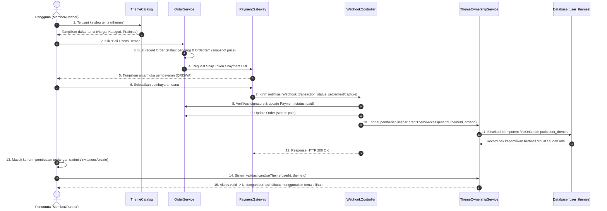

# 04. Alur Transaksi, Pembayaran & Kepemilikan Tema (Commerce & Ownership Flow)

Dokumen ini merinci arsitektur sistem pembelian tema, pemisahan tanggung jawab (*separation of concerns*) antara transaksi dan inventori, mekanisme *snapshot pricing*, penanganan webhook pembayaran yang idempoten, serta aturan validasi akses saat membuat atau mengedit undangan.

---

## 1. Prinsip Pemisahan Tanggung Jawab (Separation of Concerns)

Untuk menghindari arsitektur yang rapuh (*tightly coupled*), sistem memisahkan domain transaksi menjadi 4 entitas independen:

```
┌──────────────┐       1:N       ┌──────────────────┐
│    ORDERS    │ ─────────────── │   ORDER_ITEMS    │
│  (Transaksi) │                 │ (Snapshot Harga) │
└──────┬───────┘                 └──────────────────┘
       │ 1:N
       ▼
┌──────────────┐                 ┌──────────────────┐
│   PAYMENTS   │ ──────────────► │   USER_THEMES    │
│ (Pembayaran) │   (Jika Paid)   │ (Hak Kepemilikan)│
└──────────────┘                 └─────────┬────────┘
                                           │ Dicek saat
                                           ▼
                                 ┌──────────────────┐
                                 │   INVITATIONS    │
                                 │(Pilihan Template)│
                                 └──────────────────┘
```

1. **`orders` (Bisnis & Invoice)**: Mewakili kesepakatan transaksi pembelian antara pengguna dan platform. Menampung nomor order, subtotal, potongan diskon, dan status akhir order.
2. **`order_items` (Snapshot Produk)**: Menampung detail tema/paket yang dibeli beserta salinan harga (`price`) pada saat transaksi berlangsung.
   > **Aturan Snapshot Pricing**: Perubahan harga `themes.price` di masa mendatang **tidak boleh** memengaruhi histori nilai transaksi yang tercatat pada `order_items.price`.
3. **`payments` (Finansial & Gateway)**: Mencatat mutasi pembayaran finansial melalui Midtrans, QRIS, transfer bank, atau verifikasi manual.
4. **`user_themes` (Inventori Hak Akses)**: Satu-satunya **sumber kebenaran (*single source of truth*)** penentu apakah seorang pengguna berhak menggunakan suatu tema desain.
   > **Kaidah Utama**: Akses tema **TIDAK BOLEH** diperiksa langsung ke tabel `orders`. Pengecekan akses tema wajib dilakukan melalui `user_themes`.

---

## 2. Diagram Alur Transaksi & Kepemilikan (Sequence Diagram)



---

## 3. Penanganan Idempotensi Webhook (Mencegah Duplikasi)

Payment Gateway (seperti Midtrans atau Xendit) dapat mengirimkan webhook yang sama beberapa kali (*retry mechanism* jika ada latensi jaringan). Agar tidak terjadi duplikasi data di `user_themes`, aturan berikut wajib diterapkan:

### A. Level Basis Data (Database Constraints)
Tabel `user_themes` memiliki indeks unik ganda:
```sql
UNIQUE KEY user_theme_unique (user_id, theme_id)
```

### B. Level Kode Layanan (Service Layer Implementation)
```php
namespace App\Services;

use App\Models\Order;
use App\Models\UserTheme;
use Illuminate\Support\Facades\DB;

class ThemeOwnershipService
{
    /**
     * Berikan hak akses tema ke akun user secara idempoten.
     */
    public function grantThemeOwnershipFromOrder(Order $order): void
    {
        // Pastikan order benar-benar sudah berstatus 'paid'
        if ($order->status !== 'paid') {
            return;
        }

        DB::transaction(function () use ($order) {
            foreach ($order->items as $item) {
                if ($item->item_type === 'theme' && $item->theme_id) {
                    UserTheme::firstOrCreate(
                        [
                            'user_id' => $order->user_id,
                            'theme_id' => $item->theme_id,
                        ],
                        [
                            'order_id' => $order->id,
                            'purchased_price' => $item->price,
                            'acquired_at' => now(),
                        ]
                    );
                }
            }
        });
    }
}
```

---

## 4. Mekanisme Penanganan Tema Gratis (Free Themes)

Tema yang ditandai dengan `is_premium = false` atau berharga `price = 0.00` dapat diakses oleh seluruh pengguna dengan salah satu dari dua pendekatan:

1. **Akses Langsung Dinamis**: Sistem memeriksa apakah `theme->is_premium === false`. Jika benar, user diizinkan menggunakan tema tersebut tanpa perlu mengecek tabel `user_themes`.
2. **Klaim Instan (Disarankan)**: Saat user memilih tema gratis untuk pertama kalinya, sistem secara otomatis mencatat record gratis ke `user_themes` dengan `purchased_price = 0.00` dan `order_id = NULL`. Hal ini membuat inventori `user_themes` selalu konsisten untuk seluruh tema yang pernah digunakan oleh akun tersebut.

---

## 5. Validasi Guard pada Pembuatan & Edit Undangan

Saat pengguna menyimpan atau memperbarui data undangan (`InvitationRequest`), sistem mengeksekusi validasi hak akses melalui `ThemeOwnershipService`:

```php
namespace App\Services;

use App\Models\Theme;
use App\Models\User;
use App\Models\UserTheme;

class ThemeOwnershipService
{
    /**
     * Periksa apakah pengguna berhak menggunakan tema tertentu.
     */
    public function canUseTheme(User $user, int $themeId): bool
    {
        // Super Admin memiliki hak akses penuh ke seluruh tema
        if ($user->isSuperAdmin()) {
            return true;
        }

        $theme = Theme::find($themeId);

        // Jika tema tidak ditemukan atau sedang dinonaktifkan
        if (! $theme || ! $theme->is_active) {
            return false;
        }

        // Jika tema berstatus gratis
        if (! $theme->is_premium || $theme->price <= 0) {
            return true;
        }

        // Periksa keberadaan lisensi di tabel user_themes
        return UserTheme::where('user_id', $user->id)
            ->where('theme_id', $themeId)
            ->exists();
    }
}
```

---

## 6. Aturan Khusus untuk Role Partner (Wedding Organizer)

Bagi pengguna dengan peran `partner`:
1. **Lisensi Tersimpan di Akun Partner**: Ketika Partner membeli tema berbayar, record kepemilikan dicatat di `user_themes` dengan `user_id` milik akun Partner.
2. **Penggunaan pada Undangan Klien**: Partner dapat menggunakan lisensi tema yang dimilikinya untuk membuatkan undangan bagi klien mana pun yang terdaftar di `partner_clients`.
3. **Ekspansi Masa Depan**: Struktur tabel `partner_clients` yang mandiri memungkinkan pengembangan skema *white-label* atau pembelian lisensi atas nama klien tanpa perlu merombak tabel inti transaksi.
